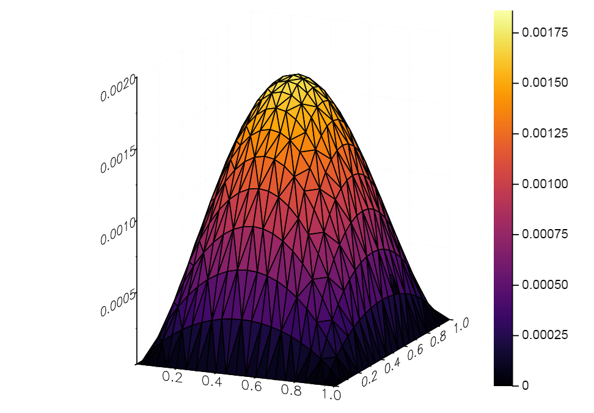
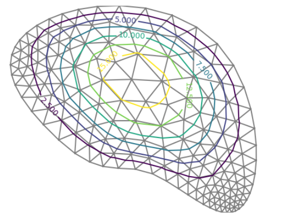

# FEMPlates.jl

[![][travis-img]][travis-url]
[![][pkg-0.6-img]][pkg-0.6-url]
[![][pkg-0.7-img]][pkg-0.7-url]
[![][coveralls-img]][coveralls-url]
[![][docs-stable-img]][docs-stable-url]
[![][docs-latest-img]][docs-latest-url]
[![][issues-img]][issues-url]

FEMPlates.jl contains mathematical formulations for plate bending problems.

Supported formulations:
- Mindlin plate

```julia
using JuliaFEM

field_elements, boundary_elements = get_unit_square()

using FEMPlates

update!(field_elements, "youngs modulus", 4880.0)
update!(field_elements, "poissons ratio", 1/3)
update!(field_elements, "thickness", 0.5)
update!(field_elements, "distributed load", 10.0)
plate = Problem(MindlinPlate, "test problem", 3)
add_elements!(plate, field_elements)
bc = Problem(Dirichlet, "fixed", 3, "displacement")
add_elements!(bc, boundary_elements)
update!(bc, "displacement 1", 0.0)
analysis = Analysis(Linear)
add_problems!(analysis, [plate, bc])
run!(analysis)

u = plate.assembly.u
X = plate("geometry", 0.0)
N = length(X)
x = [X[i][1] for i=1:N]
y = [X[i][2] for i=1:N]

using Plots
surface(x, y, u[1:3:end])
```



# Discrete Kirchhoff plate

```julia
using JuliaFEM
using JuliaFEM.Preprocess
add_elements! = JuliaFEM.add_elements!
meshfile = Pkg.dir("FEMPlates", "examples", "dkt", "mesh.med")
mesh = aster_read_mesh(meshfile)
field_elements = create_elements(mesh, "PLATE")
update!(field_elements, "youngs modulus", 210.0e9)
update!(field_elements, "poissons ratio", 0.3)
update!(field_elements, "thickness", 50.0e-3)
update!(field_elements, "distributed load", 1.0)
plate = Problem(DKT, "test problem", 3)
add_elements!(plate, field_elements)
boundary_elements = create_elements(mesh, "BORDER")
update!(boundary_elements, "displacement 1", 0.0)
bc = Problem(Dirichlet, "fixed", 3, "displacement")
add_elements!(bc, boundary_elements)
analysis = Analysis(Linear)
add_problems!(analysis, [plate, bc])
run!(analysis)
```




[contrib-url]: https://juliafem.github.io/FEMPlates.jl/latest/man/contributing/
[discourse-tag-url]: https://discourse.julialang.org/tags/boundingsphere
[gitter-url]: https://gitter.im/JuliaFEM/JuliaFEM.jl

[docs-latest-img]: https://img.shields.io/badge/docs-latest-blue.svg
[docs-latest-url]: https://juliafem.github.io/FEMPlates.jl/latest

[docs-stable-img]: https://img.shields.io/badge/docs-stable-blue.svg
[docs-stable-url]: https://juliafem.github.io/FEMPlates.jl/stable

[travis-img]: https://travis-ci.org/JuliaFEM/FEMPlates.jl.svg?branch=master
[travis-url]: https://travis-ci.org/JuliaFEM/FEMPlates.jl

[coveralls-img]: https://coveralls.io/repos/github/JuliaFEM/FEMPlates.jl/badge.svg?branch=master
[coveralls-url]: https://coveralls.io/github/JuliaFEM/FEMPlates.jl?branch=master

[issues-img]: https://img.shields.io/github/issues/JuliaFEM/FEMPlates.jl.svg
[issues-url]: https://github.com/JuliaFEM/FEMPlates.jl/issues

[pkg-0.6-img]: http://pkg.julialang.org/badges/BoundingSphere_0.6.svg
[pkg-0.6-url]: http://pkg.julialang.org/?pkg=BoundingSphere&ver=0.6
[pkg-0.7-img]: http://pkg.julialang.org/badges/BoundingSphere_0.7.svg
[pkg-0.7-url]: http://pkg.julialang.org/?pkg=BoundingSphere&ver=0.7

